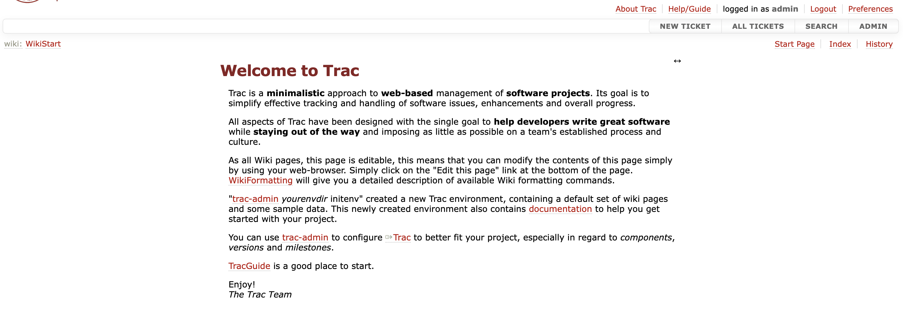
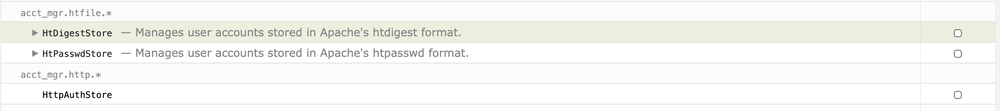
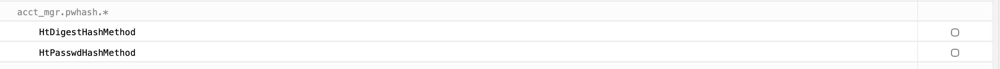
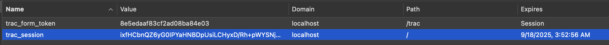

# Trac-LDAP-Apache Integration

Guide for setting up a secure integration of **Apache** and **OpenLDAP** for user authentication in the **Trac Issue Tracker**.

This setup utilizes `mod_authnz_ldap` and `mod_auth_form` for handling login/logout with session cookies. Additionally, a **Dockerfile** is provided for creating a **Trac** container, as there's no official one.

[Blog Post](https://medium.com/@khushwantk/implementing-ldap-authentication-for-trac-both-dockerized-via-apache-efe02a72023a)


---

- [Trac-LDAP-Apache Integration](#trac-ldap-apache-integration)
  - [System Architecture](#system-architecture)
  - [Setup and Configuration](#setup-and-configuration)
  - [File Descriptions](#file-descriptions)
  - [Debugging](#debugging)
  - [Screenshots](#screenshots)

---

## System Architecture

The integration involves three main components:

1.  **Trac**: Dockerized Trac Issue Tracker.
2.  **OpenLDAP**: Dockerized OpenLDAP server.
3.  **Apache HTTP Server**

**Apache** acts as a reverse proxy for **Trac**, handling user authentication against the **OpenLDAP** server. The `mod_authnz_ldap` module authenticates users, while `mod_auth_form` manages login/logout and session cookies.

---


## Setup and Configuration

Follow these steps to set up the integrated environment:

1. **Configure and start the OpenLDAP Container**


2.  **Configure Trac**:
    * Open the `trac.conf` file according to your LDAP.
    * Modify the `AuthLDAPURL` to point to your **OpenLDAP** server. For example:
        ```apache
        AuthLDAPURL "ldap://openldap:389/ou=users,dc=example,dc=org?uid"
        AuthLDAPBindDN "cn=admin,dc=example,dc=org"
        AuthLDAPBindPassword admin

        AuthLDAPURL "ldap://openldap:389/ou=users,dc=example,dc=org?uid?sub?(objectClass=inetOrgPerson)"
        AuthLDAPBindDN "cn=admin,dc=example,dc=org"
        AuthLDAPBindPassword admin
        ```

5.  **Compose up Trac Container**:
    ```bash
    docker-compose up -d --build trac
    ```
    login, logout, logo.png, trac.conf, trac.ini will be copied to the container.


---

## File Descriptions

* **`Dockerfile`**: Environment for the **Trac** container, including the installation of necessary dependencies and configurations.
* **`trac.ini`**: The main configuration file for **Trac**, containing settings for authentication, database, and other plugins.
* **`trac.conf`**: The **Apache** configuration file that sets up the reverse proxy, authentication, and authorization for **Trac**.
* **`login.html` / `logout.html`**: Custom pages for handling user login and logout.

---

## Debugging

Here are some commands to help you troubleshoot the setup:

* **Check OpenLDAP Connectivity**:
    ```bash
    docker-compose exec trac ping openldap
    ```

* **List Trac Sessions**:
    ```bash
    docker-compose exec trac trac-admin /var/local/trac session list
    ```

* **Delete a Trac Session**:
    ```bash
    docker-compose exec trac trac-admin /var/local/trac session delete <username>
    ```

* **Edit Configuration Files**:
    ```bash
    docker-compose exec trac nano /var/local/trac/conf/trac.ini
    docker-compose exec trac nano /etc/apache2/sites-available/trac.conf
    docker-compose exec trac nano /var/www/html/login.html
    ```

* **Monitor Trac Logs**:
    ```bash
    docker-compose exec trac tail -f /var/local/trac/log/trac.log
    ```

## Screenshots

**Main Login page**





**No DigestStore and AuthStore used**





